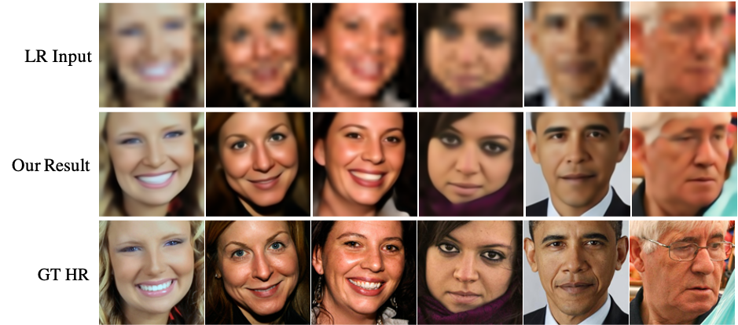

# SPARNet: Learning Spatial Attention for Face Super-Resolution in PyTorch 

[Learning Spatial Attention for Face Super-Resolution](http://arxiv.org/abs/2012.01211)  
[**Chaofeng Chen**](https://chaofengc.github.io), [Dihong Gong](https://www.cise.ufl.edu/~dihong/), [Hao Wang](https://dblp.uni-trier.de/pid/w/HaoWang50.html), [Zhifeng Li](https://dblp.org/pid/56/2053.html), [Kwan-Yee K. Wong](https://i.cs.hku.hk/~kykwong/)


## Installation and Requirements 

Clone this repository
```
git clone https://github.com/chaofengc/Face-SPARNet.git
cd Face-SPARNet
```

I have tested the codes on
- Ubuntu 18.04
- CUDA 10.1  
- Python 3.7, install required packages by `pip3 install -r requirements.txt`  

## Getting Started 

### Download Pretrain Models and Dataset
Download the pretrained models and data from the following link and put them to `./pretrain_models` and `./test_dirs` respectively
- [Github](https://github.com/chaofengc/Face-SPARNet/releases/tag/v0.1.0)  
- [BaiduNetDisk](https://pan.baidu.com/s/1zYimaAnIgMIKBf9KANpxog), extract code: `2nax`   

### Test with Pretrained Models

We provide example test commands in script `test.sh` for both SPARNet and SPARNetHD. Two models with difference configurations are provided for each of them, refer to [section below](#differences-with-the-paper) to see the differences. Here are some test tips:

- SPARNet upsample a 16x16 bicubic downsampled face image to 128x128, and there is **no need to align the LR face**.   
- SPARNetHD enhance a low quality face image and generate high quality 512x512 outputs, and the LQ inputs **should be pre-aligned as FFHQ**.  
- Please specify test input directory with `--dataroot` option.  
- Please specify save path with `--save_as_dir`, otherwise the results will be saved to predefined directory `results/exp_name/test_latest`.  

We also provide command to crop and align faces from single image, and then paste them back, the same as [PSFRGAN](https://github.com/chaofengc/PSFRGAN) 
```
python test_enhance_single_unalign.py --gpus 1 --model sparnethd --name SPARNetHD_V4_Attn2D \
    --res_depth 10 --att_name spar --Gnorm 'in' \
    --pretrain_model_path [./path/to/model/SPARNetHD_V4_Attn2D_net_H-epoch10.pth] \
    --test_img_path ./test_images/test_hzgg.jpg --results_dir test_hzgg_results
```

### Train the Model

The commands used to train the released models are provided in script `train.sh`. Here are some train tips:

- You should download [CelebA](http://mmlab.ie.cuhk.edu.hk/projects/CelebA.html) and [FFHQ](https://github.com/NVlabs/ffhq-dataset) to train SPARNet and SPARNetHD respectively. Please change the `--dataroot` to the path where your training images are stored.  
- To train SPARNet, we simply crop out faces from CelebA without pre-alignment, because for ultra low resolution face SR, it is difficult to pre-align the LR images.  
- Please change the `--name` option for different experiments. Tensorboard records with the same name will be moved to `check_points/log_archive`, and the weight directory will only store weight history of latest experiment with the same name.  
- `--gpus` specify number of GPUs used to train. The script will use GPUs with more available memory first. To specify the GPU index, uncomment the `export CUDA_VISIBLE_DEVICES=` 
- SPARNetHD needs **at least 25GB memory to train with `batch_size=2`**. 

## Differences with the Paper
Since the original codes are messed up, we rewrite the codes and retrain all models. This leads to slightly different results between the released model and those reported in the paper. Besides, we also extend the 2D spatial attention to 3D attention, and release some models with 3D attention. We list all of them below

### SPARNet 

We found that extending 2D spatial attention to 3D attention improves the performance a lot. We trained a light model with half parameter number by reducing the number of FAU blocks, denoted as SPARNet-Light-Attn3D. SPARNet-Light-Attn3D shows similar performance with SPARNet. We also released the model for your reference.   

| Model          | DICNet      | SPARNet (in paper) | SPARNet (Released) | SPARNet-Light-Attn3D (Released) |
| -----------    | ----------- | -----------        | -----------        | -----------                     |
| #Params(M)     | 22.8        | 9.86               | 10.52              | 5.24                            |
| PSNR (&#8593;) | 26.73       | 26.97              | **27.43**          | 27.39                           |
| SSIM (&#8593;) | 0.7955      | 0.8026             | **0.8201**         | 0.8189                          |

*All models are trained with CelebA and tested on Helen test set provided by [DICNet](https://github.com/Maclory/Deep-Iterative-Collaboration)*



### SPARNetHD

We also provide network with 2D and 3D attention for SPARNetHD. For the test dataset, we clean up non-face images, add some extra test images from internet, and obtain a new CelebA-TestN dataset with 1117 images. We test the retrained model on the new dataset and recalculate the FID scores.

Similar as StyleGAN, we use the exponential moving average weight as the final model, which shows slightly better results.

| Model         | SPARNetHD (in paper) | SPARNetHD-Attn2D (Released) | SPARNetHD-Attn3D (Released) |
| -----------   | -----------          | -----------                 | -----------                 |
| FID (&#8595;) | 27.16                | **26.72**                   | 28.42                       |


## Citation
```bib
@ARTICLE{ChenSPARNet,
      author = {Chen, Chaofeng and Gong, Dihong and Wang, Hao and Li, Zhifeng and Wong, Kwan-Yee~K.},
      journal={IEEE Transactions on Image Processing}, 
      title={Learning Spatial Attention for Face Super-Resolution}, 
      year={2021},
      volume={30},
      number={},
      pages={1219-1231},
      doi={10.1109/TIP.2020.3043093}
}

```

## License

<a rel="license" href="http://creativecommons.org/licenses/by-nc-sa/4.0/"></a><br />This work is licensed under a <a rel="license" href="http://creativecommons.org/licenses/by-nc-sa/4.0/">Creative Commons Attribution-NonCommercial-ShareAlike 4.0 International License</a>.

## Acknowledgement

The codes are based on [CycleGAN](https://github.com/junyanz/pytorch-CycleGAN-and-pix2pix). The project also benefits from [DICNet](https://github.com/Maclory/Deep-Iterative-Collaboration).  
